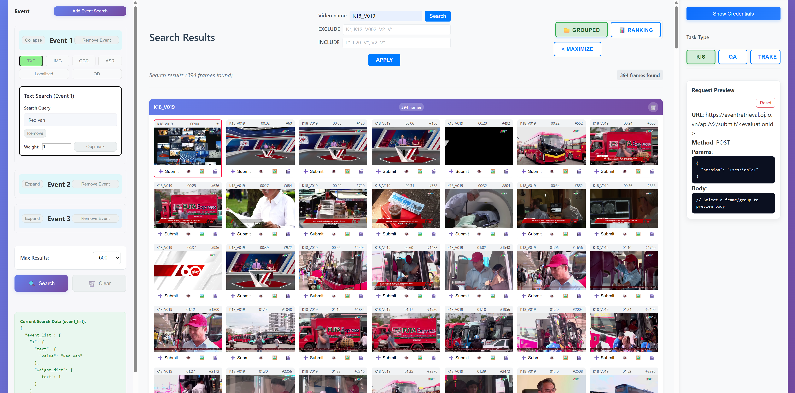

# AIC25 Retrieval System UI

This project is a modern web-based User Interface for the AIC25 Multimedia Retrieval System, built with React.js. It provides an intuitive and interactive platform for searching, browsing, and visualizing multimedia data, such as videos and images, using advanced retrieval techniques.

## Demo

The retrieval system UI in action:




## Features

- **Fast and Responsive UI:** Built with React.js and Vite for optimal performance.
- **Advanced Search:** Search and retrieve multimedia content using text, image, or metadata queries.
- **Visualization:** View search results with rich previews and metadata.
- **Integration:** Connects seamlessly with the backend retrieval engine and Elasticsearch for real-time results.
- **User-Friendly:** Clean, modern design for easy navigation and usability.

## Getting Started

### Prerequisites
- [Node.js](https://nodejs.org/) (v14 or higher recommended)
- [npm](https://www.npmjs.com/) (comes with Node.js)

### Installation
Clone the repository and install dependencies:

```bash
git clone https://github.com/PhucNg2k/AIC25_UI.git
cd AIC25_UI
npm install
```

### Running the Development Server

```bash
npm run dev
```

The app will be available at [http://localhost:5173](http://localhost:5173) (or as indicated in your terminal).

## Project Structure

- `src/` - Main source code for the React UI
- `public/` - Static assets
- `vite.config.js` - Vite configuration

## Backend Integration

This UI is designed to work with the AIC25 backend retrieval system. Ensure the backend and Elasticsearch services are running and accessible as configured in the project.

